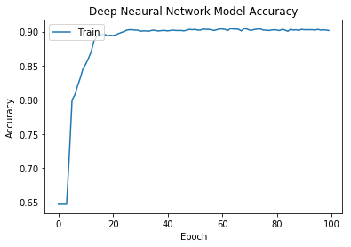
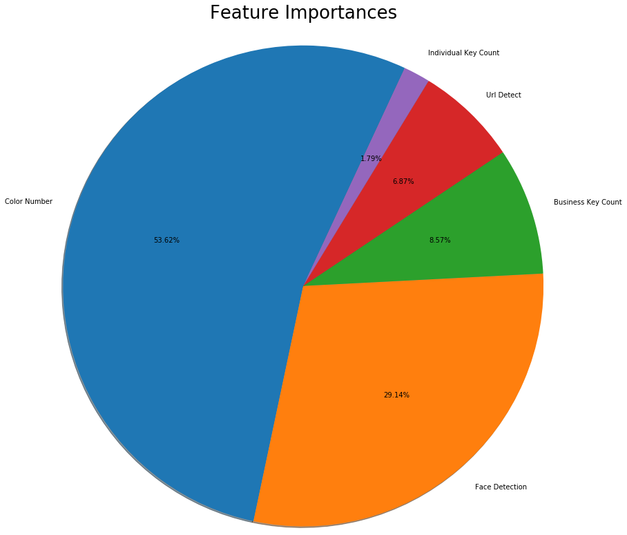

```python
import pandas as pd
```


```python
df = pd.read_csv("final_output.csv", encoding = "latin1")
```


```python
df.head()
```


<div>
<style scoped>
    .dataframe tbody tr th:only-of-type {
        vertical-align: middle;
    }

    .dataframe tbody tr th {
        vertical-align: top;
    }

    .dataframe thead th {
        text-align: right;
    }
</style>
<table border="1" class="dataframe">
  <thead>
    <tr style="text-align: right;">
      <th></th>
      <th>label</th>
      <th>id</th>
      <th>name</th>
      <th>username</th>
      <th>bio</th>
      <th>location</th>
      <th>url</th>
      <th>join_date</th>
      <th>join_time</th>
      <th>tweets</th>
      <th>...</th>
      <th>media</th>
      <th>private</th>
      <th>verified</th>
      <th>profile_image_url</th>
      <th>background_image</th>
      <th>color_number</th>
      <th>face_detection</th>
      <th>follower/following_ratio</th>
      <th>b_key_count</th>
      <th>i_key_count</th>
    </tr>
  </thead>
  <tbody>
    <tr>
      <th>0</th>
      <td>individual</td>
      <td>379823034</td>
      <td>mohammed</td>
      <td>BarcaMohammed</td>
      <td>NaN</td>
      <td>North Bergen</td>
      <td>NaN</td>
      <td>9/25/11</td>
      <td>9:33:00</td>
      <td>172.0</td>
      <td>...</td>
      <td>1.0</td>
      <td>0.0</td>
      <td>0.0</td>
      <td>https://pbs.twimg.com/profile_images/166601617...</td>
      <td>NaN</td>
      <td>51912.0</td>
      <td>0.0</td>
      <td>0.023256</td>
      <td>0.0</td>
      <td>0.0</td>
    </tr>
    <tr>
      <th>1</th>
      <td>individual</td>
      <td>931229576</td>
      <td>SaMisches</td>
      <td>Shmisch</td>
      <td>NaN</td>
      <td>NaN</td>
      <td>NaN</td>
      <td>11/6/12</td>
      <td>20:41:00</td>
      <td>6.0</td>
      <td>...</td>
      <td>3.0</td>
      <td>0.0</td>
      <td>0.0</td>
      <td>https://pbs.twimg.com/profile_images/930857677...</td>
      <td>NaN</td>
      <td>31033.0</td>
      <td>0.0</td>
      <td>0.108696</td>
      <td>0.0</td>
      <td>0.0</td>
    </tr>
    <tr>
      <th>2</th>
      <td>individual</td>
      <td>393095898</td>
      <td>Christopher Pawelski</td>
      <td>ChrisPawelski</td>
      <td>A 4th generation family onion farmer married t...</td>
      <td>Florida, NY</td>
      <td>http://about.me/chris_pawelski</td>
      <td>10/17/11</td>
      <td>18:00:00</td>
      <td>49503.0</td>
      <td>...</td>
      <td>23400.0</td>
      <td>0.0</td>
      <td>0.0</td>
      <td>https://pbs.twimg.com/profile_images/686658233...</td>
      <td>https://pbs.twimg.com/profile_banners/39309589...</td>
      <td>46205.0</td>
      <td>0.0</td>
      <td>1.085431</td>
      <td>0.0</td>
      <td>1.0</td>
    </tr>
    <tr>
      <th>3</th>
      <td>individual</td>
      <td>3109060051</td>
      <td>xrishin</td>
      <td>xrishin</td>
      <td>NaN</td>
      <td>NaN</td>
      <td>NaN</td>
      <td>3/26/15</td>
      <td>19:39:00</td>
      <td>3.0</td>
      <td>...</td>
      <td>0.0</td>
      <td>1.0</td>
      <td>0.0</td>
      <td>https://abs.twimg.com/sticky/default_profile_i...</td>
      <td>NaN</td>
      <td>184.0</td>
      <td>0.0</td>
      <td>0.050000</td>
      <td>0.0</td>
      <td>0.0</td>
    </tr>
    <tr>
      <th>4</th>
      <td>business</td>
      <td>1.13E+18</td>
      <td>LENDVER</td>
      <td>LendverLLC</td>
      <td>BORROW CONFIDENTLY. WeŠ__΢Š—_’öÎ劗_’•Î¢ve do...</td>
      <td>NaN</td>
      <td>https://www.lendver.com/</td>
      <td>5/29/19</td>
      <td>7:32:00</td>
      <td>2.0</td>
      <td>...</td>
      <td>1.0</td>
      <td>0.0</td>
      <td>0.0</td>
      <td>https://pbs.twimg.com/profile_images/113375859...</td>
      <td>https://pbs.twimg.com/profile_banners/11337428...</td>
      <td>510.0</td>
      <td>0.0</td>
      <td>0.090909</td>
      <td>0.0</td>
      <td>0.0</td>
    </tr>
  </tbody>
</table>
<p>5 rows × 23 columns</p>
</div>


```python
df.shape
```


    (2357, 7)


```python
df.columns
```


    Index(['label', 'id', 'name', 'username', 'bio', 'location', 'url',
           'join_date', 'join_time', 'tweets', 'following', 'followers', 'likes',
           'media', 'private', 'verified', 'profile_image_url', 'background_image',
           'color_number', 'face_detection', 'follower/following_ratio',
           'b_key_count', 'i_key_count'],
          dtype='object')


```python
# 999 was a code we used when executing python face_detection library on twitter profile pictures. 
# Specifically, 999 indicated that there was an error/no picture found when iterating through thr profile pictures
df = df[df.face_detection != 999]
# code 1 was assigned if a face was deteced, code 0 was assigned if a face was not detected.
```


```python
df.shape
```


    (11264, 23)


```python
# Create a column in dataframe indicating whether a url was linked on the twitter page or not. 
# If a url was detected, code 1 was assigned, else, 0 was assigned.
array = []
for i in list(df["url"]):
    if str(i) != "nan":
        array.append(1)
    else:
        array.append(0)
df["url_detect"] = array
```


```python
# color_number column is a column that gives a count of the number of colors a profile picture has.
# We noticed that pictures with 184 colors all linked to the same default twitter profile picture.
# Since no face recognition or insightful color count can be returned and properly evaluated by the model,
# we decided to drop all rows that have a color count of 184.
# Coincidentally, we noticed color_number = 0 all corresponding face_detection = 999.
# Even though that was already dropped, we decided to add this precaution in case this was used on future scraped data
df = df[(df.color_number != 184) & (df.color_number !=0)]
```


```python
df.shape
```


    (10467, 24)


```python
# Dataset used had 11401 rows, unclassified as business or not. Our team went into each twitter page to classify
# whether the page was a business or individual. Since 1000s of rows could not be manually classified, 
# we dropped many unclassified rows
df = df.loc[(df["label"] == "individual") | (df["label"] == "business"), :]
```


```python
df.shape
```


    (2359, 24)


```python
# Drop columns we dont need for modeling
# df = df.drop(columns = ["name", "id", "url", "bio", "location", "join_date", "join_time", \
#                         "private", "verified", "profile_image_url", "background_image"])
df = df[["label", "username", "face_detection", "color_number", "b_key_count", "i_key_count", "url_detect"]]
```


```python
df = df.dropna(how="any")

# Dropping data must be the last step, because there are blank fields in the dropped columns, which may have values
# in the variables we will take into consideration. Dropping pre-emptively will drop many rows unnecessarily
```


```python
df.shape
```


    (2357, 7)


```python
df.head()
```


<div>
<style scoped>
    .dataframe tbody tr th:only-of-type {
        vertical-align: middle;
    }

    .dataframe tbody tr th {
        vertical-align: top;
    }

    .dataframe thead th {
        text-align: right;
    }
</style>
<table border="1" class="dataframe">
  <thead>
    <tr style="text-align: right;">
      <th></th>
      <th>label</th>
      <th>username</th>
      <th>face_detection</th>
      <th>color_number</th>
      <th>b_key_count</th>
      <th>i_key_count</th>
      <th>url_detect</th>
    </tr>
  </thead>
  <tbody>
    <tr>
      <th>0</th>
      <td>individual</td>
      <td>BarcaMohammed</td>
      <td>0.0</td>
      <td>51912.0</td>
      <td>0.0</td>
      <td>0.0</td>
      <td>0</td>
    </tr>
    <tr>
      <th>1</th>
      <td>individual</td>
      <td>Shmisch</td>
      <td>0.0</td>
      <td>31033.0</td>
      <td>0.0</td>
      <td>0.0</td>
      <td>0</td>
    </tr>
    <tr>
      <th>2</th>
      <td>individual</td>
      <td>ChrisPawelski</td>
      <td>0.0</td>
      <td>46205.0</td>
      <td>0.0</td>
      <td>1.0</td>
      <td>1</td>
    </tr>
    <tr>
      <th>4</th>
      <td>business</td>
      <td>LendverLLC</td>
      <td>0.0</td>
      <td>510.0</td>
      <td>0.0</td>
      <td>0.0</td>
      <td>1</td>
    </tr>
    <tr>
      <th>6</th>
      <td>individual</td>
      <td>ClaretSport</td>
      <td>1.0</td>
      <td>41897.0</td>
      <td>0.0</td>
      <td>0.0</td>
      <td>1</td>
    </tr>
  </tbody>
</table>
</div>


```python
# Assign X (data) and y (target)
X = df.drop(["label", "username"], axis=1)
y = df["label"]
print(X.shape, y.shape)
```

    (2357, 5) (2357,)


```python
from sklearn.model_selection import train_test_split

X_train, X_test, y_train, y_test = train_test_split(X, y, random_state=1, stratify=y)
```


```python
from sklearn.preprocessing import StandardScaler

# Create a StandardScater model and fit it to the training data
X_scaler = StandardScaler().fit(X_train)
```

    /Users/kyleeng/anaconda3/envs/PythonData/lib/python3.7/site-packages/sklearn/preprocessing/data.py:625: DataConversionWarning: Data with input dtype int64, float64 were all converted to float64 by StandardScaler.
      return self.partial_fit(X, y)


```python
# Transform the training and testing data using the X_scaler

X_train_scaled = X_scaler.transform(X_train)
X_test_scaled = X_scaler.transform(X_test)
```

    /Users/kyleeng/anaconda3/envs/PythonData/lib/python3.7/site-packages/ipykernel_launcher.py:3: DataConversionWarning: Data with input dtype int64, float64 were all converted to float64 by StandardScaler.
      This is separate from the ipykernel package so we can avoid doing imports until
    /Users/kyleeng/anaconda3/envs/PythonData/lib/python3.7/site-packages/ipykernel_launcher.py:4: DataConversionWarning: Data with input dtype int64, float64 were all converted to float64 by StandardScaler.
      after removing the cwd from sys.path.


```python
from sklearn.preprocessing import LabelEncoder
from keras.utils import to_categorical

# Step 1: Label-encode data set (y_train was previously "business" or "individual", which needed to be numbers) 
label_encoder = LabelEncoder()
label_encoder.fit(y_train)
encoded_y_train = label_encoder.transform(y_train)
encoded_y_test = label_encoder.transform(y_test)


# Step 2: Convert encoded labels to one-hot-encoding
y_train_categorical = to_categorical(encoded_y_train)
y_test_categorical = to_categorical(encoded_y_test)
```

    Using TensorFlow backend.


```python
# first, create a normal neural network with 5 inputs, 6 hidden nodes, and 2 outputs
from tensorflow.keras.models import Sequential
from tensorflow.keras.layers import Dense

model = Sequential()
model.add(Dense(units=6, activation='tanh', input_dim=5))
model.add(Dense(units=2, activation='softmax'))
```

    WARNING:tensorflow:From /Users/kyleeng/anaconda3/envs/PythonData/lib/python3.7/site-packages/tensorflow/python/ops/resource_variable_ops.py:435: colocate_with (from tensorflow.python.framework.ops) is deprecated and will be removed in a future version.
    Instructions for updating:
    Colocations handled automatically by placer.


```python
model.summary()
```

    _________________________________________________________________
    Layer (type)                 Output Shape              Param #   
    =================================================================
    dense (Dense)                (None, 6)                 36        
    _________________________________________________________________
    dense_1 (Dense)              (None, 2)                 14        
    =================================================================
    Total params: 50
    Trainable params: 50
    Non-trainable params: 0
    _________________________________________________________________


```python
# Compile the model
model.compile(optimizer='adam',
              loss='categorical_crossentropy',
              metrics=['accuracy'])
```


```python
# Fit the model to the training data
fit = model.fit(
    X_train_scaled,
    y_train_categorical,
    epochs=100,
    shuffle=True,
    verbose=0
)
```

    WARNING:tensorflow:From /Users/kyleeng/anaconda3/envs/PythonData/lib/python3.7/site-packages/tensorflow/python/ops/math_ops.py:3066: to_int32 (from tensorflow.python.ops.math_ops) is deprecated and will be removed in a future version.
    Instructions for updating:
    Use tf.cast instead.


```python
import matplotlib.pyplot as plt
# Plot training accuracy by Epoch

plt.plot(fit.history['acc'])
plt.title('Normal Neural Network Model Accuracy')
plt.ylabel('Accuracy')
plt.xlabel('Epoch')
plt.legend(['Train'], loc='upper left')
plt.show()
```


    <Figure size 640x480 with 1 Axes>


```python
deep_model = Sequential()
deep_model.add(Dense(units=2, activation='tanh', input_dim=5))
deep_model.add(Dense(units=2, activation='relu'))
deep_model.add(Dense(units=2, activation='softmax'))
```


```python
deep_model.compile(optimizer='adam',
                   loss='categorical_crossentropy',
                   metrics=['accuracy'])

deep_fit = deep_model.fit(
    X_train_scaled,
    y_train_categorical,
    epochs=100,
    shuffle=True,
    verbose=0
)
```


```python
plt.plot(deep_fit.history['acc'])
plt.title('Deep Neaural Network Model Accuracy')
plt.ylabel('Accuracy')
plt.xlabel('Epoch')
plt.legend(['Train'], loc='upper left')
plt.show()
```





```python
model_loss, model_accuracy = model.evaluate(
    X_test_scaled, y_test_categorical, verbose=2)
print(
    f"Normal Neural Network - Loss: {model_loss}, Accuracy: {model_accuracy}")
```

     - 0s - loss: 0.2697 - acc: 0.9034
    Normal Neural Network - Loss: 0.26970285833892177, Accuracy: 0.9033898115158081


```python
model_loss, model_accuracy = deep_model.evaluate(
    X_test_scaled, y_test_categorical, verbose=2)
print(f"Deep Neural Network - Loss: {model_loss}, Accuracy: {model_accuracy}")
```

     - 0s - loss: 0.2770 - acc: 0.9000
    Deep Neural Network - Loss: 0.27698996940911824, Accuracy: 0.8999999761581421


```python
# Save the model
model.save("twitter_normal_neural_trained.h5")
```


```python
# Create a random forest classifier
from sklearn.ensemble import RandomForestClassifier
rf = RandomForestClassifier(n_estimators=200)
rf = rf.fit(X_train_scaled, y_train_categorical)
rf.score(X_train_scaled, y_train_categorical)
```


    0.9949066213921901


```python
# Get weights that machine defined, multiplied by 100 to get percents
importances = rf.feature_importances_*100
importances
```


    array([29.14403578, 53.62206409,  8.5650469 ,  1.79430819,  6.87454503])


```python
# Create data frame of features and their importance; convert to csv
feature_importances = sorted(zip(importances, X), reverse=True)
feature_importances = list(feature_importances)
feature_importances = pd.DataFrame(feature_importances, columns = ["Importance", "Feature Name"])
feature_importances.to_csv("Outputs/feature_importances.csv", index=False)
```


```python
#  Plot feature importances
labels = [label.title().replace("_", " ").replace("B", "Business").replace("I", "Individual") \
          for label in feature_importances["Feature Name"]]

plt.pie(feature_importances["Importance"], labels=labels,
        autopct="%1.2f%%", shadow=True, startangle=65, radius=4)
plt.title("Feature Importances", y = 2.25, fontsize = 26)
plt.show()
```





```python
encoded_predictions = model.predict_classes(X_test_scaled)
prediction_labels = label_encoder.inverse_transform(encoded_predictions)
comparison = pd.DataFrame({"prediction": prediction_labels, "actual": y_test})
comparison.head()
```


<div>
<style scoped>
    .dataframe tbody tr th:only-of-type {
        vertical-align: middle;
    }

    .dataframe tbody tr th {
        vertical-align: top;
    }

    .dataframe thead th {
        text-align: right;
    }
</style>
<table border="1" class="dataframe">
  <thead>
    <tr style="text-align: right;">
      <th></th>
      <th>prediction</th>
      <th>actual</th>
    </tr>
  </thead>
  <tbody>
    <tr>
      <th>10300</th>
      <td>business</td>
      <td>business</td>
    </tr>
    <tr>
      <th>1404</th>
      <td>individual</td>
      <td>individual</td>
    </tr>
    <tr>
      <th>10284</th>
      <td>individual</td>
      <td>individual</td>
    </tr>
    <tr>
      <th>2494</th>
      <td>business</td>
      <td>business</td>
    </tr>
    <tr>
      <th>1935</th>
      <td>business</td>
      <td>individual</td>
    </tr>
  </tbody>
</table>
</div>


```python
# joined dataset so we can see usernames and predictions/actual side by side
merged_comparsion = df.join(comparison)
merged_comparsion = merged_comparsion[["username", "prediction", "actual"]]
merged_comparsion = merged_comparsion.dropna(how="any")
merged_comparsion.head()
```


<div>
<style scoped>
    .dataframe tbody tr th:only-of-type {
        vertical-align: middle;
    }

    .dataframe tbody tr th {
        vertical-align: top;
    }

    .dataframe thead th {
        text-align: right;
    }
</style>
<table border="1" class="dataframe">
  <thead>
    <tr style="text-align: right;">
      <th></th>
      <th>username</th>
      <th>prediction</th>
      <th>actual</th>
    </tr>
  </thead>
  <tbody>
    <tr>
      <th>2</th>
      <td>ChrisPawelski</td>
      <td>individual</td>
      <td>individual</td>
    </tr>
    <tr>
      <th>10</th>
      <td>Arvidinvest</td>
      <td>individual</td>
      <td>individual</td>
    </tr>
    <tr>
      <th>17</th>
      <td>pattyshort</td>
      <td>individual</td>
      <td>individual</td>
    </tr>
    <tr>
      <th>21</th>
      <td>HarshnaParoha</td>
      <td>individual</td>
      <td>individual</td>
    </tr>
    <tr>
      <th>23</th>
      <td>jsare34</td>
      <td>individual</td>
      <td>individual</td>
    </tr>
  </tbody>
</table>
</div>


```python
merged_comparsion.to_csv("Outputs/merged_comparsion_test.csv", index=False)
```


```python
# get rows in which the predicted did not match the actual data
discrepencies = comparison[comparison["prediction"] != comparison["actual"]]
discrepencies.head()
```


<div>
<style scoped>
    .dataframe tbody tr th:only-of-type {
        vertical-align: middle;
    }

    .dataframe tbody tr th {
        vertical-align: top;
    }

    .dataframe thead th {
        text-align: right;
    }
</style>
<table border="1" class="dataframe">
  <thead>
    <tr style="text-align: right;">
      <th></th>
      <th>prediction</th>
      <th>actual</th>
    </tr>
  </thead>
  <tbody>
    <tr>
      <th>1935</th>
      <td>business</td>
      <td>individual</td>
    </tr>
    <tr>
      <th>629</th>
      <td>individual</td>
      <td>business</td>
    </tr>
    <tr>
      <th>487</th>
      <td>business</td>
      <td>individual</td>
    </tr>
    <tr>
      <th>1385</th>
      <td>individual</td>
      <td>business</td>
    </tr>
    <tr>
      <th>317</th>
      <td>individual</td>
      <td>business</td>
    </tr>
  </tbody>
</table>
</div>


```python
business_discrepencies = discrepencies.loc[(discrepencies["prediction"] == "business"), :]
business_discrepencies.shape
```


    (32, 2)


```python
individual_discrepencies = discrepencies.loc[(discrepencies["prediction"] == "individual"), :]
individual_discrepencies.shape
```


    (25, 2)


```python
# join data frames to include username and join on index; index number was previously retained
merged_discrepencies = df.join(discrepencies)
merged_discrepencies = merged_discrepencies[["username", "face_detection", "color_number", \
                                             "b_key_count", "i_key_count", "url_detect", "prediction", "actual"]]
merged_discrepencies = merged_discrepencies.dropna(how="any")
merged_discrepencies.head()
```


<div>
<style scoped>
    .dataframe tbody tr th:only-of-type {
        vertical-align: middle;
    }

    .dataframe tbody tr th {
        vertical-align: top;
    }

    .dataframe thead th {
        text-align: right;
    }
</style>
<table border="1" class="dataframe">
  <thead>
    <tr style="text-align: right;">
      <th></th>
      <th>username</th>
      <th>face_detection</th>
      <th>color_number</th>
      <th>b_key_count</th>
      <th>i_key_count</th>
      <th>url_detect</th>
      <th>prediction</th>
      <th>actual</th>
    </tr>
  </thead>
  <tbody>
    <tr>
      <th>50</th>
      <td>72Services</td>
      <td>1.0</td>
      <td>33542.0</td>
      <td>0.0</td>
      <td>0.0</td>
      <td>1</td>
      <td>individual</td>
      <td>business</td>
    </tr>
    <tr>
      <th>128</th>
      <td>smcolonius</td>
      <td>0.0</td>
      <td>5265.0</td>
      <td>0.0</td>
      <td>0.0</td>
      <td>1</td>
      <td>business</td>
      <td>individual</td>
    </tr>
    <tr>
      <th>166</th>
      <td>EduardoVega01</td>
      <td>0.0</td>
      <td>8172.0</td>
      <td>0.0</td>
      <td>0.0</td>
      <td>1</td>
      <td>business</td>
      <td>individual</td>
    </tr>
    <tr>
      <th>184</th>
      <td>ASFASTAS1232</td>
      <td>0.0</td>
      <td>4246.0</td>
      <td>0.0</td>
      <td>0.0</td>
      <td>1</td>
      <td>business</td>
      <td>individual</td>
    </tr>
    <tr>
      <th>225</th>
      <td>stephanieybk</td>
      <td>0.0</td>
      <td>65.0</td>
      <td>0.0</td>
      <td>0.0</td>
      <td>0</td>
      <td>business</td>
      <td>individual</td>
    </tr>
  </tbody>
</table>
</div>


```python
# Pre-processing. All the same steps as was done on test data set

unclassified = pd.read_csv("final_output.csv", encoding ="latin1")

unclassified = unclassified[unclassified.face_detection != 999]

array = []
for i in list(unclassified["url"]):
    if str(i) != "nan":
        array.append(1)
    else:
        array.append(0)
unclassified["url_detect"] = array

unclassified = unclassified[(unclassified.color_number != 184) & (unclassified.color_number !=0)]

unclassified = unclassified[["label", "username", "face_detection", "color_number", \
                             "b_key_count", "i_key_count", "url_detect"]]

# get only nan values from label
unclassified = unclassified[unclassified.label != "business"]
unclassified = unclassified[unclassified.label != "individual"]

# add index number column for a join
unclassified = unclassified.reset_index()
# Will need to drop all NaN values, but cannot do this without removing label column from data frame.
# Create temporary data frame with index column so it can be later joined
unclassified_label = unclassified[["index", "label"]]
# unclassified = unclassified.drop(["label"], axis=1)
unclassified = unclassified.drop(["label"], axis=1)
unclassified = unclassified.dropna(how="any")
unclassified = unclassified_label.merge(unclassified, how="inner", on="index")


unclassified_X = unclassified.drop(["index", "label", "username"], axis=1)
unclassified_X.shape
```


    (8016, 5)


```python
# Create a StandardScater model and fit it to the training data
X_scaler = StandardScaler().fit(unclassified_X)
```

    /Users/kyleeng/anaconda3/envs/PythonData/lib/python3.7/site-packages/sklearn/preprocessing/data.py:625: DataConversionWarning: Data with input dtype int64, float64 were all converted to float64 by StandardScaler.
      return self.partial_fit(X, y)


```python
X_scaled = X_scaler.transform(unclassified_X)
```

    /Users/kyleeng/anaconda3/envs/PythonData/lib/python3.7/site-packages/ipykernel_launcher.py:1: DataConversionWarning: Data with input dtype int64, float64 were all converted to float64 by StandardScaler.
      """Entry point for launching an IPython kernel.


```python
# Predict on new data set
unclassified_predictions = model.predict_classes(X_scaled)
prediction_labels = label_encoder.inverse_transform(unclassified_predictions)

unclassified_pred_df = pd.DataFrame({"unclassified predictions": prediction_labels})
unclassified_pred_df.shape
```


    (8016, 1)


```python
unclassified_merge = unclassified.join(unclassified_pred_df)
unclassified_merge = unclassified_merge[["username", "face_detection", "color_number", \
                                             "b_key_count", "i_key_count", "url_detect", "unclassified predictions"]]
unclassified_merge.head()
```


<div>
<style scoped>
    .dataframe tbody tr th:only-of-type {
        vertical-align: middle;
    }

    .dataframe tbody tr th {
        vertical-align: top;
    }

    .dataframe thead th {
        text-align: right;
    }
</style>
<table border="1" class="dataframe">
  <thead>
    <tr style="text-align: right;">
      <th></th>
      <th>username</th>
      <th>face_detection</th>
      <th>color_number</th>
      <th>b_key_count</th>
      <th>i_key_count</th>
      <th>url_detect</th>
      <th>unclassified predictions</th>
    </tr>
  </thead>
  <tbody>
    <tr>
      <th>0</th>
      <td>caitiecouch325</td>
      <td>1.0</td>
      <td>33377.0</td>
      <td>0.0</td>
      <td>0.0</td>
      <td>1</td>
      <td>individual</td>
    </tr>
    <tr>
      <th>1</th>
      <td>SadaKaloZia</td>
      <td>1.0</td>
      <td>38147.0</td>
      <td>0.0</td>
      <td>0.0</td>
      <td>1</td>
      <td>individual</td>
    </tr>
    <tr>
      <th>2</th>
      <td>MusketeersTele</td>
      <td>0.0</td>
      <td>106.0</td>
      <td>0.0</td>
      <td>0.0</td>
      <td>0</td>
      <td>business</td>
    </tr>
    <tr>
      <th>3</th>
      <td>repport4</td>
      <td>0.0</td>
      <td>9045.0</td>
      <td>0.0</td>
      <td>0.0</td>
      <td>0</td>
      <td>business</td>
    </tr>
    <tr>
      <th>4</th>
      <td>twerkGerl</td>
      <td>0.0</td>
      <td>35878.0</td>
      <td>0.0</td>
      <td>0.0</td>
      <td>1</td>
      <td>business</td>
    </tr>
  </tbody>
</table>
</div>


```python
unclassified_merge.to_csv("Outputs/unclassified_merge.csv", index=False)
```
